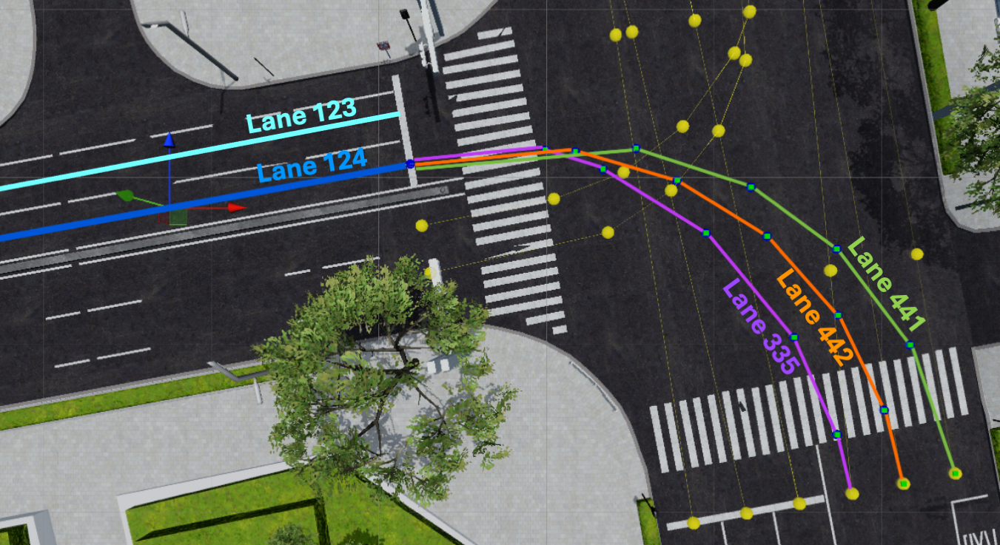
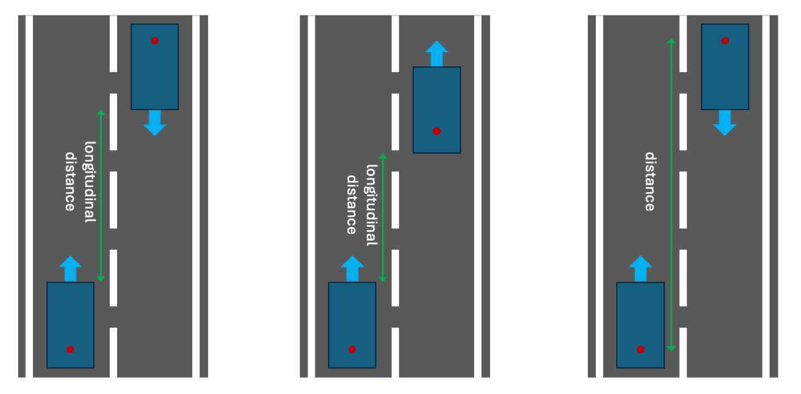

## AWSIM-ScriptPy - A Flexible Interface for Scenario Specification in AWSIM-Labs and Autoware

This is the client library of AWSIM-ScriptPy, a flexible interface for scenario specification in the [AWSIM-Labs simulator](https://github.com/duongtd23/AWSIM-Labs) for the [Autoware](https://github.com/autowarefoundation/autoware) autonomous driving system (ADS).

The server interface is implemented in the extended [AWSIM-Labs](https://github.com/duongtd23/AWSIM-Labs) simulator.

### Usage
There are two possible ways to specify a scenario: using `.script` files (original AWSIM-Script) or using the Python interface.
We recommend using the Python interface for more flexibility and expressiveness.

#### Python Scenario Specification
Some example scenarios are available in [scenarios](scenarios) folder.
Let's consider a cutin scenario, specified in [scenarios/cutin/example.py](scenarios/cutin/example.py) file:

```python
from core.scenario_manager import *
from core.trigger_condition import *

scenario_manager = ScenarioManager()
network = scenario_manager.network
_, _, init_pos, init_orient = network.parse_lane_offset(LaneOffset('111'))
_, _, goal_pos, goal_orient = network.parse_lane_offset(LaneOffset('111', 130))
ego = EgoVehicle()
ego.add_action(SpawnEgo(position=init_pos, orientation=init_orient))
ego.add_action(SetGoalPose(position=goal_pos, orientation=goal_orient))
ego.add_action(ActivateAutonomousMode(condition=autonomous_mode_ready()))
ego.add_action(SetVelocityLimit(30/3.6))

_, source_lane, npc_init_pos, npc_init_orient = network.parse_lane_offset(LaneOffset('112', 70))
npc1 = NPCVehicle("npc1", body_style=BodyStyle.HATCHBACK)
next_lane = network.parse_lane('111')
npc1.add_action(SpawnNPCVehicle(position=npc_init_pos, orientation=npc_init_orient))
npc1.add_action(FollowLane(target_speed=10/3.6,
                           condition=av_speed >= 30/3.6-0.1))
npc1.add_action(ChangeLane(next_lane=next_lane,
                           lateral_velocity=1.0,
                           condition=longitudinal_distance_to_ego <= 15))
scenario = Scenario(network, [ego, npc1])
scenario_manager.run([scenario])
```

There are two vehicles in this scenario: the ego vehicle and an NPC vehicle (`npc1`).
Two lanes `111` and `112` are straight and parallel to each other, with `111` on the left of `112`.
The ego vehicle spawns on lane `111` at offset `0m`, sets its goal at offset `130m` on the same lane, activates autonomous driving mode when ready, and sets its speed limit to `30 km/h` (thanks to the `parse_lane_offset` helper function).
The NPC vehicle spawns on lane `112` at offset `70m`, but its motion is delayed.
Once the ego vehicle's speed reaches `30 km/h`, the NPC vehicle starts to follow its current lane `112` at `10 km/h`.
When the ego vehicle is within `15m` longitudinal distance to the NPC vehicle, the NPC vehicle changes to lane `111` with a lateral velocity of `1.0 m/s` (i.e., it cuts in front of the ego vehicle).
Check the detailed explanation of predefined actions and conditions below for more details.

To run this scenario, first launch the AWSIM-Labs simulator and Autoware.
An instruction to run AWSIM-Labs and Autoware is available in the [AWSIM-Labs repo](https://github.com/duongtd23/AWSIM-Labs?tab=readme-ov-file#1-launch-awsim-labs-and-autoware)
Note that Autoware is not needed if the ego actor does not appear in the scenario specification.

After launching the two tools and they are properly connected, 
in another terminal, run the scenario above as a normal Python program:
```bash
python -m scenarios.cutin.example
```
Make sure to source the folder where Autoware was installed first.
The two videos below show the execution of this cut-in scenario under two different viewpoints:


https://github.com/user-attachments/assets/43e1fe6b-6de3-400b-a8cd-b060a5faedb0


https://github.com/user-attachments/assets/a753aff0-4d94-4dc2-ad40-93fb25c0a6cc


Note that multiple scenarios can be passed and run sequentially, for example, see file [scenarios/cutin/all.py](scenarios/cutin/all.py).
See [Predefined Actions](#predefined-actions) and [Predefined Conditions](#predefined-conditions) sections below for more details on how to specify scenarios using the Python interface.

#### Using .script Files
Again, we recommend using the Python interface for more flexibility and expressiveness.
However, if you want to use the original `.script` files, please check [this file](Origin-AWSIM-Script.md).

### Predefined Actions
Some predefined actions for common tasks are available in [actions](actions) folder.
#### Ego Vehicle Actions
- `Spawning`: Spawn the ego vehicle at a specified position and orientation (precisely, reset initial pose), and perform ADS re-localization. Note that precise 3D coordinates can be obtained from a lane offset expression with our helper functions, like
  ```python
  _, _, position, orientation = network.parse_lane_offset(LaneOffset('111', 10))
  ```
- `SetGoalPose`: Set the goal pose for the ego vehicle at a specified position and orientation. A goal is required for Autoware to perform autonomous driving.
- `ActivateAutonomousMode`: Activate the autonomous driving mode in Autoware.
This action should be specified with the condition that the autonomous driving mode is ready (at least after setting the initial pose and goal pose).
- `SetVelocityLimit`: Set the speed limit for the ego vehicle. Note that the real speed at each moment depends on Autoware's planning and control modules.



#### Other Vehicle Actions
- `SpawnNPCVehicle`: Spawn a non-player character (NPC) vehicle at a specified position and orientation.
- `FollowLane`: Make the NPC vehicle follow the corresponding lane at the current position (without specifying the lane explicitly). 
  - If the lane later splits into multiple lanes (e.g., near an intersection), one next lane to follow is chosen randomly. For instance, in the figure above, if the NPC vehicle is on lane `124` and approaches the intersection, it may randomly choose to follow lane `441` or `442` or `335` (to turn right) once finishing lane `124`.
  - Instead of letting the NPC vehicle choose next lanes randomly like above, we can also explicitly specify the desired next lane to follow by passing `lane` parameter to the `FollowLane` action. For instance, the following specification makes the NPC vehicle follow lane `335` after finishing lane `124`:
  ```python
  npc1.add_action(FollowLane(
       lane='TrafficLane.335', 
       condition=end_lane('TrafficLane.124', network)))
  ```

  - We can also specify a desired speed profile, by passing `target_speed` (m/s) and `acceleration` (m/s^2). If `target_speed` is not specified, the NPC vehicle will follow the speed limit of the lane. `acceleration` value will be used for both speeding up and braking. If `acceleration` is not specified, a default-comfortable value will be used.

- `SetTargetSpeed`: Set the target speed for the NPC vehicle. The vehicle will accelerate or decelerate to reach the target speed. Again, we can also specify desired `acceleration`. By passing the `target_speed=0`, we can make the NPC vehicle stop.

- `ChangeLane`: Make the NPC vehicle change to the given `next_lane` argument. The lane must be adjacent to the current lane of the vehicle.
To control how fast the lane change is performed, we can also specify `lateral_velocity` (in m/s). For instance, if `npc1` is currently on lane `123`, which is on the left of lane `124` in the figure above, the following code makes it change to lane `124` with a lateral velocity of `1.3` m/s when it reaches the point at offset 10m on lane `123`:
  ```python
  lane_124 = network.parse_lane(`124`)
  npc1.add_action(ChangeLane(
      next_lane=lane_124, 
      lateral_velocity=1.3, 
      condition=reach_point(LaneOffset('123', 10), network)))
  ```
- `FollowWaypoints`: Make the NPC vehicle follow a sequence of specified waypoints (3D positions) (forming the vehicle trajectory).
The front-center point of the vehicle will follow the specified waypoints in order, i.e., once the front-center point reaches a waypoint, it will head to the next waypoint. 
There are two ways to use this action:
  - Specify a waypoint sequence directly at the time of action initialization:
  ```python
  waypoints = [
      {"x": 10, "y": 5, "z": 0},
      {"x": 20, "y": 15, "z": 0},
      {"x": 30, "y": 25, "z": 0},
  ]
  npc1.add_action(FollowWaypoints(waypoints=waypoints))
  ```
  - There exists a case such that the waypoints cannot be determined at the time of action initialization, for example, when the waypoints depend on the current state (like position and velocity) of the (NPC) actor as well as the ego vehicle. In this case, we can provide a callback function that calculates the waypoints based on the current global state and the given actor. For example:
  ```python
  def cal_waypoints(actor, global_state):
      # Calculate waypoints based on the current state
      waypoints = []
      # ... populate waypoints ...
      return waypoints

  npc1.add_action(SpawnNPCVehicle(...))
  npc1.add_action(FollowLane(...))
  npc1.add_action(FollowWaypoints(
    waypoints_calculation_callback=cal_waypoints,
    condition=longitudinal_distance_to_ego <= dx0))
  ```

  This is a powerful action, and we argue that we can specify any desired trajectory for NPC vehicles using this action.

### Predefined Conditions
Some predefined conditions for action triggering are available in [core/trigger_condition.py](core/trigger_condition.py) file.
- `autonomous_mode_ready()`: Condition that checks whether the autonomous driving mode is ready in Autoware. It should be used for the `ActivateAutonomousMode` action as follows:
  ```python
  ego.add_action(ActivateAutonomousMode(
      condition=autonomous_mode_ready()))
  ```

- `end_lane(lane: str, network: Network)`: Condition that checks whether the actor has reached the end of the specified lane. An example usage has been shown in the `FollowLane` action description above.
- `reach_point(lane_offset: LaneOffset, network: Network)`: Condition that checks whether the actor has reached the specified point (given as lane offset). An example usage has been shown in the `ChangeLane` action description above.

- `distance_to_ego <comparison-operator> threshold`, where `comparison-operator` is either `<`, `<=`, `>`, or `>=`: Condition that checks the distance from the concern actor to the ego vehicle satisfies the given comparison with the specified threshold (in meters). For example, to trigger an action for the concern NPC actor when the ego vehicle is within `20` meters, we can use:
  ```python
  distance_to_ego <= 20
  ```
  Note that `distance_to_ego` does not account for the actor and ego vehicle's shape.



- `longitudinal_distance_to_ego <comparison-operator> threshold`, where `comparison-operator` is either `<`, `<=`, `>`, or `>=`: Condition that checks the longitudinal distance from the concern actor to the ego vehicle satisfies the given comparison with the specified threshold (in meters). The longitudinal distance is calculated along the lane centerline of the concern actor, taking into account the actor and ego vehicle's length. The figure above illustrates the difference between `longitudinal_distance_to_ego` (left and middle figures) and `distance_to_ego` (right figure).

- `actor_speed <comparison-operator> threshold`: Condition that checks the speed of the concern actor satisfies the given comparison with the specified threshold (in m/s).
- `av_speed <comparison-operator> threshold`: Condition that checks the speed of the ego vehicle satisfies the given comparison with the specified threshold (in m/s).

### Define New Actions and Conditions
You can define new actions by extending the `Action` class (defined in [core/action.py](core/action.py) file), and implementing the `_do(actor, global_state)` method.  This method is called when the action is triggered for the given `actor`, with the current `global_state`. See the existing actions in [actions](actions) folder for reference.

Similarly, you can define new trigger conditions. If the condition involves numeric comparisons (like distance or speed comparisons), we recommend to use the predefined wrapper class `Measurement` (defined in [core/trigger_condition.py](core/trigger_condition.py) file) to implement the condition. See the existing conditions like `distance_to_ego` and `actor_speed` for reference.


### Example Scenarios
In the [scenarios](scenarios) folder, you can find some example scenarios that demonstrate the expressiveness of AWSIM-ScriptPy.