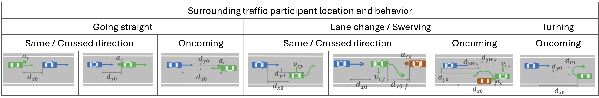

## Scenarios
In this folder, you can find some example scenarios that demonstrate the expressiveness of AWSIM-ScriptPy.

- [follow_lane](follow_lane.py): A simple scenario with a single NPC vehicle.
It means that, only AWSIM-Labs is required to run this scenario.
- [random](random): Some mixed scenarios.
- [cutin](cutin), [swerve](swerve), [uturn](uturn), [cutout](cutout), [deceleration](deceleration): Contain scenarios cut-in, swerve, U-turn, cut-out, and deceleration scenarios from the [JAMA Standard](https://www.jama.or.jp/english/reports/docs/Automated_Driving_Safety_Evaluation_Framework_Ver3.0.pdf). 
These scenarios are used for assessing the safety performance of an autonomous driving system (ADS).
The figure below (from the JAMA Standard) depicts seven scenarios that must be considered on non-intersection roads where the ego vehicle (in blue) keeps going straight.
  

  So far, scenarios in cells #1 (a vehicle in the back accelerates) and #3 (a vehicle approaches from the opposite direction and tends to hit the ego vehicle) have not been considered yet.