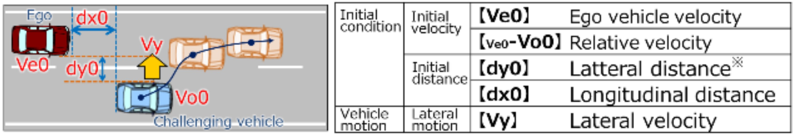

## Cut-in Scenarios

This folder contains the specification in AWSIM-ScriptPy for cut-in scenarios from the [JAMA Standard](https://www.jama.or.jp/english/reports/docs/Automated_Driving_Safety_Evaluation_Framework_Ver3.0.pdf).
The following figure (from the JAMA Standard) illustrates an example of a cut-in scenario.



The ego vehicle (in red) is traveling straight in its lane at a constant speed of $ve$
An NPC vehicle (in blue) traveling in the adjacent lane abruptly at a constant speed of $vo$ cuts in front of the ego vehicle.
The JAMA standard introduces various parameters to define a concrete cut-in scenario (see the figure above):
- $dx_0$: Longitudinal distance between the ego vehicle and the NPC vehicle when the cut-in starts.
- $ve$: Speed of the ego vehicle.
- $vo$: Speed of the NPC vehicle.
- $vy$: Lateral speed of the NPC vehicle during the cut-in maneuver.

Other parameters such as lane widths and vehicle dimensions are fixed values defined in the JAMA standard.
For each parameter setting of $dx_0$, $ve$, $vo$, and $vy$, the JAMA standard indicates whether a collision can be avoided through braking alone or if a collision is unavoidable for an ideal ADS.
Essentially, this is done by introducing a careful and excellent human driver model, and requiring that the ADS performs at least as well as this human driver model.
Readers are referred to the JAMA standard (Section 2.3.3.1) for more details.

### Scenario Specification in AWSIM-ScriptPy
Here, we provide AWSIM-ScriptPy implementations for several cut-in scenarios from the JAMA standard, and they can be simulated in the Autoware-AWSIM-Labs environment.
The base implementation is in the [base.py](base.py) file, and specific parameter settings are in separate files such as [cutin_30_10.py](cutin_30_10.py).

The following code snippet (from [base.py](base.py)) shows the main idea of how to implement the JAMA's cut-in maneuver in AWSIM-ScriptPy:
```python
next_lane = network.parse_lane(cutin_next_lane)
npc1.add_action(SpawnNPCVehicle(position=npc_init_pos, orientation=npc_init_orient))
npc1.add_action(FollowLane(target_speed=_npc_speed,
                            condition=av_speed >= _ego_speed-0.2))
npc1.add_action(ChangeLane(next_lane=next_lane,
                            lateral_velocity=_cutin_vy,
                            condition=longitudinal_distance_to_ego <= dx0))
```

In this code, after spawning the NPC vehicle, we let it follow its lane at a constant speed of `_npc_speed` until the ego vehicle's speed almost reaches its target speed `_ego_speed`.
Once the longitudinal distance between the NPC vehicle and the ego vehicle becomes less than or equal to `dx0`, the NPC vehicle starts changing lanes to cut in front of the ego vehicle at a lateral speed of `_cutin_vy`.

We argue that these cut-in scenarios can be easily specified in AWSIM-ScriptPy with its predefined actions and conditions.

### Scenario Execution