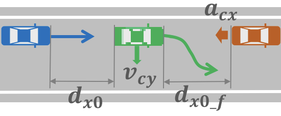

## Cut-out Scenarios

This folder contains the specification in AWSIM-ScriptPy for **cut-out** scenarios from the [JAMA Standard](https://www.jama.or.jp/english/reports/docs/Automated_Driving_Safety_Evaluation_Framework_Ver3.0.pdf).
The following figure (from the JAMA Standard) illustrates an example of a cut-out scenario.



The ego vehicle (in blue) is following a leading NPC vehicle (in green) in the same lane. 
Both maintain a constant speed of $v$ and the initial longitudinal distance between them is $d_{x0} = 2*v$ (or 2 Time-Head-Way (THW)).
At a certain moment, the lead NPC vehicle suddenly changes lanes to right to avoid another stopping vehicle (in orange) ahead.
The relevant parameters for this scenario are:
- $v$: The speed of the two vehicles (m/s)
<!-- - $d_{x0}$: Longitudinal distance between the two vehicles (m) -->
- $v_{cy}$: Lateral velocity of the lead NPC vehicle during the lane change (m/s)
- $d_{x0\_f}$: Longitudinal distance between the cut-out (green) vehicle and the stopping (orange) vehicle when the changing lanes (cut-out) starts.

For each parameter setting of $v$, $v_{cy}$, and $d_{x0\_f}$, based on the JAMA's good driver model, we can determine whether the ego vehicle can avoid a collision (between blue and orange vehicles) through braking alone or if a collision is unavoidable for an ideal ADS.
Readers are referred to the JAMA standard (Section 2.3.3.1) for more details.
Note that a collision between the cut-out vehicle (green) and the stopping vehicle (orange) may happen, depending on the values of $v_{cy}$ and $d_{x0\_f}$. However, this kind of collision is not relevant to the evaluation of the ego vehicle's ADS.

### Scenario Specification in AWSIM-ScriptPy

We want to use AWSIM-ScriptPy to implement these JAMA's cut-out scenarios, such that they can be simulated in the Autoware-AWSIM-Labs environment to check the performance of Autoware.

#### A naive implementation
A naive implementation (from [base.py](base.py)) would look like this:
```python
# _speed: v
# calculate the longitudinal distance to trigger the movement of the cut-out NPC so that 
# after accelerating to _speed, longitudinal distance between it and ego is dx0=2.0*_speed
dx0 = 2.0 * _speed
speedup_time = _speed/acceleration
speedup_dis = _speed**2 / 2 / acceleration
# distance ego travels during the time NPC speeds up to _speed
dis_ego = _speed * speedup_time
my_dx = dx0 + dis_ego - speedup_dis

next_lane = network.parse_lane(cutout_next_lane)

# cut-out NPC specification
_, _, npc_init_pos, npc_init_orient = network.parse_lane_offset(cutout_npc_init_laneoffset)
npc1 = NPCVehicle("npc1", body_style)
npc1.add_action(SpawnNPCVehicle(position=npc_init_pos, orientation=npc_init_orient))
npc1.add_action(FollowLane(target_speed=_speed,
                            acceleration=acceleration,
                            condition=longitudinal_distance_to_ego <= my_dx))
# cut-out manuver: change lane with lateral velocity vy
npc1.add_action(ChangeLane(next_lane=next_lane,
                            lateral_velocity=vy,
                            condition=actor_speed >= _speed))

# stopped NPC specification (challenging vehicle)
npc2 = NPCVehicle("npc2", body_style)
# calculate the spawning position and orientation 
stop_pos, stop_orient = ...
npc2.add_action(SpawnNPCVehicle(position=stop_pos, orientation=stop_orient))
```

In this code, the cut-out NPC vehicle is spawned but its movement is delayed until the ego vehicle comes within a certain longitudinal distance `my_dx`, which is a bit greater than `dx0`.
This is because we need some additional room for the NPC speeding up to `_speed` from 0, during which the ego vehicle is also moving forward.
The trigger distance `my_dx` will ensure that once the NPC reaches `_speed`, the longitudinal distance between the two vehicles is exactly `dx0`.

For the challenging stopped NPC vehicle, we simply spawn it at a fixed position ahead of the cut-out NPC, based on the given parameter $d_{x0\_f}$.

However, similar to the deceleration scenario, if running this specification, we will see that Autoware will reduce its speed far enough before reaching the `npc1`.
Thus, at the moment when NPC is triggered to move, the ego vehicle speed is actually much lower than `_speed`, and this naive implementation failed to reproduce the JAMA's cut-out scenario correctly.
In other words, this is because Autoware is conservative, making it difficult to realize the longitudinal distance and ego's speed conditions correctly.

#### Dynamic spawning NPC
Similar to the deceleration scenario, we introduce an alternative implementation that dynamically spawns the moving NPC vehicle when the ego vehicle has the target speed `_speed`.
The code is as follows (from [dynamic_spawn.py](dynamic_spawn.py)):

```python
# cut-out NPC
npc1 = NPCVehicle("npc1", body_style)
npc1_root_to_rearcenter = npc1.size[0]/2 - npc1.center[0]

# function to calculate the spawn pose of the cut-out vehicle based on the AV's global state
def npc1_pose_cal(actor, global_state):
    ego_kin = global_state['actor-kinematics']['ego']
    ego_pos = np.array(ego_kin['pose']['position'])
    ego_front_center = actor.get_front_center(ego_pos, ego_kin['pose']['rotation'][2])
    forward = (ego_front_center - ego_pos)[:2]
    forward = forward / np.linalg.norm(forward)
    npc_pos = ego_front_center[:2] + (2 * _speed + npc1_root_to_rearcenter) * forward
    orient = utils.quaternion_from_yaw(ego_kin['pose']['rotation'][2]/180*np.pi)
    return np.append(npc_pos, ego_front_center[2]), orient

# dynamically spawn the cut-out vehicle when AV speed >= _speed
npc1.add_action(SpawnNPCVehicle(pose_callback=npc1_pose_cal,
                                condition=av_speed >= _speed))
# Set the moving speed without acceleration step 
npc1.add_action(FollowLane(target_speed=_speed,
                            acceleration=500))
next_lane = network.parse_lane(cutout_next_lane)
# make cut-out manuver: change lane with lateral velocity vy
npc1.add_action(ChangeLane(next_lane=next_lane,
                            lateral_velocity=vy,
                            condition=actor_speed >= _speed))

# stopped NPC (challenging vehicle)
npc2 = NPCVehicle("npc2", body_style)
npc2_root_to_rearcenter = npc2.size[0]/2 - npc2.center[0]

# function to calculate the position of the stopped vehicle
def npc2_pose_cal(actor, global_state):
    ego_kin = global_state['actor-kinematics']['ego']
    ego_pos = np.array(ego_kin['pose']['position'])
    ego_front_center = actor.get_front_center(ego_pos, ego_kin['pose']['rotation'][2])
    forward = (ego_front_center - ego_pos)[:2]
    forward = forward / np.linalg.norm(forward)
    npc_pos = ego_front_center[:2] + (2 * _speed + npc1.size[0] + dx_f + npc2_root_to_rearcenter) * forward
    orient = utils.quaternion_from_yaw(ego_kin['pose']['rotation'][2]/180*np.pi)
    return np.append(npc_pos, ego_front_center[2]), orient

# all we need to do is to spawn it
npc2.add_action(SpawnNPCVehicle(pose_callback=npc2_pose_cal,
                                condition=av_speed >= _speed))
```

Here, instead of passing a concrete position and orientation to `SpawnNPCVehicle`, we pass the `npc1_pose_cal` and `npc2_pose_cal` functions that calculate the spawn pose of the two NPCs dynamically based on the current position of the ego vehicle, similar to the deceleration case.
Once the ego vehicle reaches the target speed `_speed`, the two vehicles are spawned accordingly.
Then, to make the cut-out behavior, we set `npc1` to be moving at the target speed `_speed` immediately (with a very high acceleration value), followed by the lane change maneuver with lateral velocity `vy`.

Although this setting does not happen in reality (due to the dynamic spawning), it can reproduce the challenge for the ADS as intended in the JAMA's cut-out scenario.

### Scenario Execution

This is the recorded video of a cut-out scenario:


https://github.com/user-attachments/assets/77d977a1-f20a-4c5b-a254-408f3354c81e

