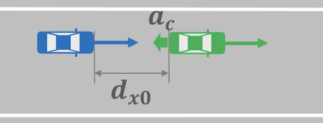

## Deceleration Scenarios

This folder contains the specification in AWSIM-ScriptPy for **deceleration** scenarios from the [JAMA Standard](https://www.jama.or.jp/english/reports/docs/Automated_Driving_Safety_Evaluation_Framework_Ver3.0.pdf).
The following figure (from the JAMA Standard) illustrates an example of a deceleration scenario.



The ego vehicle (in blue) is following a leading NPC vehicle (in green) in the same lane. 
Both maintain a constant speed of $v$ and the initial longitudinal distance between them is $d_{x0} = 2*v$ (or 2 Time-Head-Way (THW)).
At a certain moment, the lead NPC vehicle suddenly decelerates at a constant deceleration rate of $a$ until it comes to a complete stop.
The relevant parameters for this scenario are:
- $v$: The speed of the two vehicles (m/s)
<!-- - $d_{x0}$: Longitudinal distance between the two vehicles (m) -->
- $a$: Deceleration rate of the lead NPC vehicle (m/s²). However, the JAMA standard fixed $a=1G$ m/s² for this scenario. Also, they suppose that there is no jerk time.

For each parameter setting of $v$, based on the JAMA's good driver model, we can determine whether a collision can be avoided through braking alone or if a collision is unavoidable for an ideal ADS.
Readers are referred to the JAMA standard (Section 2.3.3.1) for more details.

### Scenario Specification in AWSIM-ScriptPy

We want to use AWSIM-ScriptPy to implement these deceleration scenarios from the JAMA standard, such that they can be simulated in the Autoware-AWSIM-Labs environment to check the performance of Autoware.

#### A naive implementation
A naive implementation (from [base.py](base.py)) would look like this:
```python
# _speed: speed of both vehicles
dx0 = 2.0 * _speed
speedup_time = _speed/acceleration
speedup_dis = _speed**2 / 2 / acceleration
# distance ego travels during the time NPC speeds up to _speed
dis_ego = _speed * speedup_time
my_dx = dx0 + dis_ego - speedup_dis

# NPC specification
_, _, npc_init_pos, npc_init_orient = network.parse_lane_offset(npc_init_laneoffset)
npc1 = NPCVehicle("npc1", body_style)
npc1.add_action(SpawnNPCVehicle(position=npc_init_pos, orientation=npc_init_orient))
npc1.add_action(FollowLane(target_speed=_speed,
                            acceleration=acceleration,
                            condition=longitudinal_distance_to_ego <= my_dx))
npc1.add_action(SetTargetSpeed(target_speed=0,
                                acceleration=-9.8,
                                condition=actor_speed >= _speed))
```

In this code, the NPC vehicle is spawned but its movement is delayed until the ego vehicle comes within a certain longitudinal distance `my_dx`, which is a bit greater than `dx0`.
This is because we need some additional room for the NPC speeding up to `_speed` from 0, during which the ego vehicle is also moving forward.
The trigger distance `my_dx` will ensure that once the NPC reaches `_speed`, the longitudinal distance between the two vehicles is exactly `dx0`.

That is the main idea of implementing these deceleration scenarios. However, if running this specification, we will see that Autoware will reduce its speed far enough before reaching the NPC.
Thus, at the moment when NPC is triggered to move, the ego vehicle speed is actually much lower than `_speed`, and this naive implementation failed to reproduce the JAMA's deceleration scenario correctly.
In other words, this is because Autoware is conservative, making it difficult to realize the longitudinal distance and ego's speed conditions correctly.

#### Dynamic spawning NPC
Due to the above issue, we propose an alternative implementation that dynamically spawns the moving NPC vehicle when the ego vehicle has the target speed `_speed`.
The code is as follows (from [dynamic_spawn.py](dynamic_spawn.py)):

```python
def pose_cal(actor, global_state):
    ego_kin = global_state['actor-kinematics']['ego']
    ego_pos = np.array(ego_kin['pose']['position'])
    ego_front_center = actor.get_front_center(ego_pos, ego_kin['pose']['rotation'][2])
    forward = (ego_front_center - ego_pos)[:2]
    forward = forward / np.linalg.norm(forward)
    npc_pos = ego_front_center[:2] + (2 * _speed + npc_root_to_back) * forward
    orient = utils.quaternion_from_yaw(ego_kin['pose']['rotation'][2]/180*np.pi)
    return np.append(npc_pos, ego_front_center[2]), orient

# dynamically spawn the NPC when AV speed >= _speed
npc1.add_action(SpawnNPCVehicle(pose_callback=pose_cal,
                                condition=av_speed >= _speed))
# Set the speed without acceleration step 
npc1.add_action(FollowLane(target_speed=_speed,
                            acceleration=500))
npc1.add_action(SetTargetSpeed(target_speed=0,
                                acceleration=-9.8,
                                condition=actor_speed >= _speed))
```

Here, instead of passing a concrete position and orientation to `SpawnNPCVehicle`, we pass the `pose_cal` function that calculates the spawn pose of the NPC dynamically based on the current position of the ego vehicle.
The calculation logic is simple, just return the position that is `2*_speed` meters ahead of the ego vehicle's front center along the ego's heading direction.
Once the ego vehicle reaches the target speed `_speed`, the NPC vehicle is spawned accordingly.
Then, we set it to be moving at the target speed `_speed` immediately (with a very high acceleration value).
Finally, the deceleration maneuver is triggered when the NPC speed reaches `_speed`.

Although this setting does not happen in reality (due to the dynamic spawning), it can reproduce the challenge for the ADS as intended in the JAMA's deceleration scenario.

### Scenario Execution

This is the recorded video of a deceleration scenario:


https://github.com/user-attachments/assets/17a9fce1-d45c-480f-9df2-4a415b2b291a

