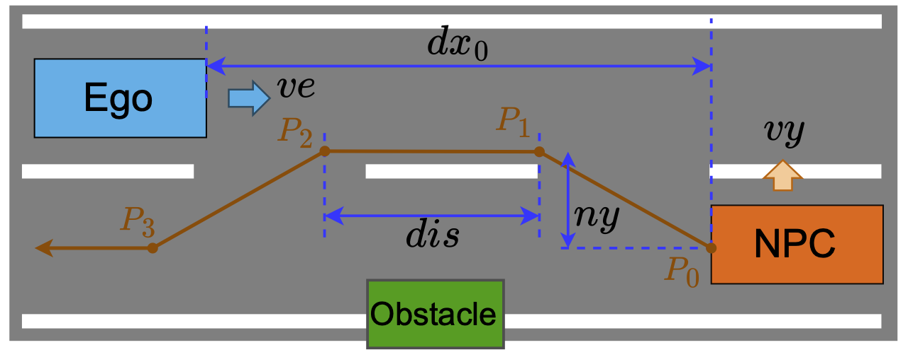

## Swerve Scenarios

This folder contains the specification in AWSIM-ScriptPy for swerve scenarios from the [JAMA Standard](https://www.jama.or.jp/english/reports/docs/Automated_Driving_Safety_Evaluation_Framework_Ver3.0.pdf).
The following figure (from the JAMA Standard) illustrates an example of a swerve scenario.



The ego vehicle (in blue) is traveling straight in its lane at a constant speed of $ve$.
An oncoming NPC vehicle (in orange) approaches from the opposite direction at a constant speed of $vo$.
At the moment when the longitudinal distance between the two vehicles is $dx_0$, the NPC vehicle begins to temporarily swerve out of its lane to avoid an obstacle, moving laterally by $ny$ with a lateral velocity of $vy$.
The NPC's trajectory is represented by four waypoints $P_0$, $P_1$, $P_2$, and $P_3$, corresponding to its front-center point at four key stages of the maneuver, as shown in the figure. 

For each parameter setting of $ve$, $vo$, etc., based on the JAMA's good driver model, we can determine whether a collision can be avoided through braking alone or if a collision is unavoidable for an ideal ADS.
Readers are referred to the JAMA standard (Section 2.3.3.1) for more details.

### Scenario Specification in AWSIM-ScriptPy

Here, we provide AWSIM-ScriptPy implementations for several swerve scenarios from the JAMA standard, such that they can be simulated in the Autoware-AWSIM-Labs environment.
The base implementation is in the [base.py](base.py) file, and specific parameter settings are in separate files such as [swerve_10_30.py](swerve_10_30.py).

The following code snippet (from [base.py](base.py)) shows the main idea of how to implement the JAMA's swerve maneuver in AWSIM-ScriptPy:
```python
# function to dynamically calculate swerve waypoints based on the world state
def cal_waypoints(actor, global_state):
    # extract the current position of the NPC vehicle and its front-center point
    npc_kin = global_state['actor-kinematics']['vehicles'].get(actor.actor_id)
    npc_pos = np.array(npc_kin['pose']['position'])
    npc_front_center = actor.get_front_center(npc_pos, npc_kin['pose']['rotation'][2])

    # The current front center point npc_front_center will be the first waypoint P0
    # Calculate the three waypoints P1, P2, P3 for the swerve maneuver
    angle = np.asin(swerve_vy / _npc_speed)
    x_shift = swerve_vy / np.tan(angle)
    direction = (npc_front_center - npc_pos)[:2]
    direction_normalized = direction / np.linalg.norm(direction)
    # This is P1.
    # The point_forward is a helper function that calculates a point shifted laterally swerve_ny and forward x_shift meters from the base point npc_front_center
    wp1 = point_forward(npc_front_center[:2],
                        direction_normalized,
                        x_shift,
                        swerve_ny if swerve_right else -swerve_ny)

    # This is P2 and P3
    wp2 = wp1 + direction_normalized * swerve_dis
    wp3 = point_forward(wp2,
                        direction_normalized,
                        x_shift,
                        -swerve_ny if swerve_right else swerve_ny)

    # To make the NPC continue straight after the swerve and make it steer back smoothly, we add one more waypoint P4
    wp4 = wp3 + direction_normalized * utils.extended_point_scale(_npc_speed)

    waypoints = [npc_front_center]
    for p in [wp1, wp2, wp3, wp4]:
        waypoints.append(np.append(p, npc_front_center[2]))

    # Convert waypoints to dict format required by FollowWaypoints action
    return [utils.array_to_dict_pos(p) for p in waypoints]

# npc specification
_, _, npc_init_pos, npc_init_orient = network.parse_lane_offset(npc_init_laneoffset)
npc1 = NPCVehicle("npc1", body_style)
npc1.add_action(SpawnNPCVehicle(position=npc_init_pos, orientation=npc_init_orient))
npc1.add_action(FollowLane(target_speed=_npc_speed,
                            acceleration=acceleration,
                            condition=av_speed >= _ego_speed - 0.2))
npc1.add_action(FollowWaypoints(waypoints_calculation_callback=cal_waypoints,
                                condition=longitudinal_distance_to_ego <= dx0))
```

In this code, after spawning the NPC vehicle, we let it follow its lane at a constant speed of `_npc_speed` until the ego vehicle's speed almost reaches its target speed `_ego_speed`.
Once the longitudinal distance between the NPC vehicle and the ego vehicle becomes less than or equal to `dx0`, the `FollowWaypoints` action is triggered, which makes the NPC vehicle perform the swerve maneuver by following the dynamically calculated waypoints.
The key part of this specification is the `cal_waypoints` function, which computes the four waypoints dynamically for the swerve maneuver based on the current position of the NPC vehicle and the specified parameters such as lateral displacement `swerve_ny`, lateral velocity `swerve_vy`, and swerve distance `swerve_dis`.

Even the swerve maneuver has a specific trajectory that does not lie on the center lane line, AWSIM-ScriptPy's flexible waypoint-based action system allows us to implement such non-standard maneuvers.
The only technical task is to implement the waypoint calculation logic encapsulated in the `cal_waypoints` function.

### Scenario Execution

This is the recorded video of a scenario execution

https://github.com/user-attachments/assets/fdfad184-a37a-40c3-8b3d-7d1732241888
